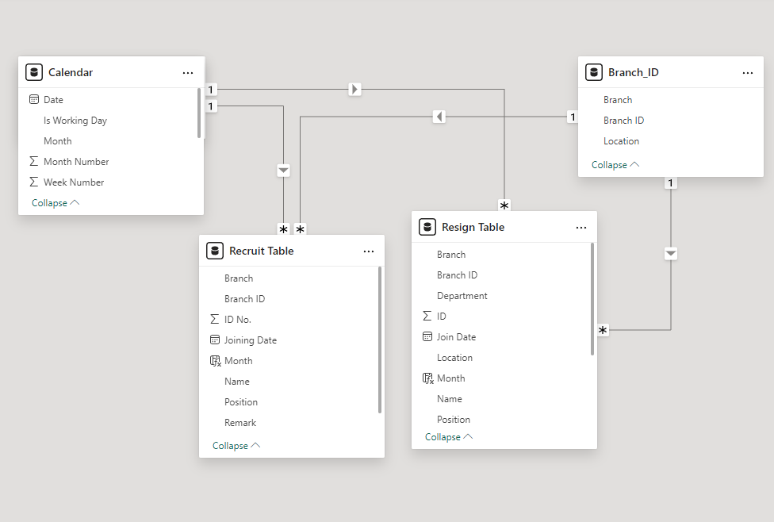
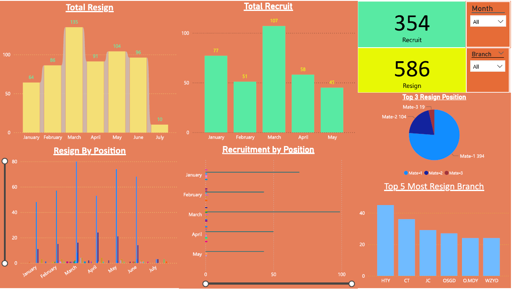

## Lotteria Myanamr HR dashbord

# Description
Freelance project for Lotteria Myanmar's HR department. 
Lotteria is a Fastfood chain from South Korea. 
Lotteria Myanmar has over 50 fastfood stores opened under the management of MYCO co.ltd across Myanmar. 
In order to ensure smooth operations of all the branches, HR department is responsible for recruiting new employees and maintain the efficient menpower. 
Although the HR department is doing their best in recruting new employees, there were complaints that the stores were having difficulties in running operations due to lack of menpower. 

# Problem
There are several problems that the HR department is currently facing.
  1. Some branch managers are complaining that the HR department cannot provide enough menpower to their stores.
  2. HR team is having hard time maintaining useful database of recruitment and resignation of employee. Recruitment data is handle mainly by HR department but when the employee resign, the store manager is to keep track of the data.
  3. Without clear data insights, the HR department cannot make effective decitions in employee retaintion.

# Goal
My job as an Data Analyst is to:
  1. Create a consistant database and data model to allow HR department to track the employee turn over.
  2. Create a dashboard to visualize the related data to gain insight of the current menpower situation across all the branchs.
  3. Make recommendations for better data practices.
  4. Training the related personals for using and maintaining the dashboard.

# Solution
Step 1.
The original recruitment data provided by HR department is in excel document[] and there were hundreds of pages of data.
Therefore, I worte a python code to iteriate each pages to identify the data tables and copy the data into [Excel Sheet](Extract_data_from_doc.py).

Step 2.
The employee resign data is in excel format but the data are not organized and there are also many unnecessary data spread thorughout huntreds of different sheets.
In order to extract only the necessary data, I wrote the python code to extract specific columns and combined them into single [Excel Sheet](Excel_sheets_combine.py).

Step 3.
After getting 2 output excel, I cleaned up the data from the excel file which include null or incorrect data types.

Step 4.
Input the excels sheets into Microsoft Power Bi and construct the data model to connect the two datasets.

Step 5.
Create data visualization in Power Bi by creating Monthly recruitment/resignation data charts, top branchs with highest resignations, highest resigned positions and total turn over rate. 

